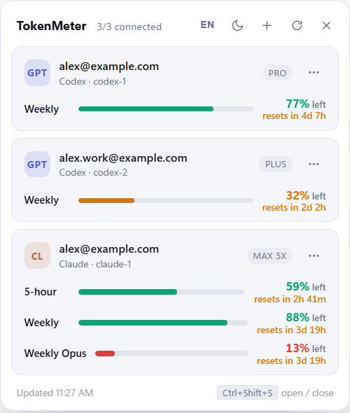

# TokenMeter

[English](README.md) · [中文](README.zh.md) · **한국어**

Codex와 Claude 구독 토큰이 얼마나 남았는지 실시간으로 보여주는 작은 Windows 트레이 앱.



- 트레이 아이콘 클릭 또는 `Ctrl+Alt+U`로 창 열기/닫기 (`Esc`로 닫기)
- 트레이 아이콘은 가장 많이 쓴 윈도우 기준 링 게이지. 초록 < 50%, 주황 < 80%, 그 이상 빨강
- 60초마다 자동 갱신, Windows 시작 시 자동 실행 (둘 다 설정 가능)
- 다크/라이트 테마, English / 中文 / 한국어. 헤더에서 전환
- 같은 서비스의 여러 계정을 한 화면에 나란히 표시

## 요구 사항

- Windows 10/11, [Node.js](https://nodejs.org) 20 이상
- 보려는 서비스의 CLI: [`codex`](https://developers.openai.com/codex/cli), [`claude`](https://docs.claude.com/en/docs/claude-code/overview)

## 설치

```
git clone https://github.com/HSoo-Kim/TokenMeter.git
cd TokenMeter
npm install
npm start
```

`TokenMeter.cmd`로도 똑같이 실행된다.

## 사용량을 읽는 방식

비밀번호를 묻지 않는다. 각 CLI가 이미 PC에 저장해 둔 OAuth 자격증명을 읽어 CLI와 동일한 usage 엔드포인트를
호출하고, 토큰이 만료되면 같은 파일에 갱신해 써서 CLI도 계속 동작한다.

| 서비스 | 자격증명 파일 | usage 엔드포인트 |
|---|---|---|
| Codex | `<home>/auth.json` | `chatgpt.com/backend-api/wham/usage` |
| Claude | `<home>/.credentials.json` | `api.anthropic.com/api/oauth/usage` |

Claude는 모델별 주간 한도도 내려주므로, API가 값을 주는 동안 `주간 Opus` 같은 행이 함께 표시된다.

## 계정

`config.json`의 항목 하나가 계정 하나이고, `home`은 그 계정의 CLI 자격증명 폴더다.

```json
{
  "hotkey": "Ctrl+Alt+U",
  "theme": "dark",
  "lang": "en",
  "pollSeconds": 60,
  "accounts": [
    { "id": "codex-1", "type": "codex", "home": "~/.codex" },
    { "id": "codex-2", "type": "codex", "home": "~/.codex-2" },
    { "id": "claude-1", "type": "claude", "home": "~/.claude" }
  ]
}
```

- 카드의 `⋯`: 로그인(공식 웹 OAuth 창), 로그아웃, 자격증명 폴더 열기, 목록에서 제거
- 헤더의 `+`: 계정 추가. `~/.codex-2` 같은 새 폴더를 만들고 거기서 로그인
- 로그인은 `CODEX_HOME` / `CLAUDE_CONFIG_DIR`를 그 폴더로 지정해 `codex login` / `claude auth login`을 실행한다.
  계정끼리 격리되고 기존 CLI 세션은 건드리지 않는다
- 로그아웃은 해당 자격증명 파일을 삭제하므로 같은 폴더를 쓰는 CLI도 함께 로그아웃된다

## 설정

테마, 언어, 단축키는 앱에서 바꾸면 `config.json`에 저장된다. 하단 단축키 칩을 클릭하면 새 조합을 녹화한다.
Ctrl / Alt / Shift 중 하나는 반드시 포함해야 하고 `Esc`로 취소한다. 다른 앱이 이미 쓰는 조합이면 기존 값을 유지한다.

`config.json`을 직접 고칠 때는 앱을 먼저 종료(트레이 메뉴 → 종료)한 뒤 수정하고 다시 실행한다.

## 개발

```
set TOKENMETER_DEMO=1 && set TOKENMETER_SHOT=%CD%\docs\screenshot.png && npm start
```

예시 계정으로 한 프레임을 렌더해 PNG로 저장하고 종료한다. `TOKENMETER_DEMO`를 빼면 실제 데이터로 찍는다.

## 라이선스

MIT
